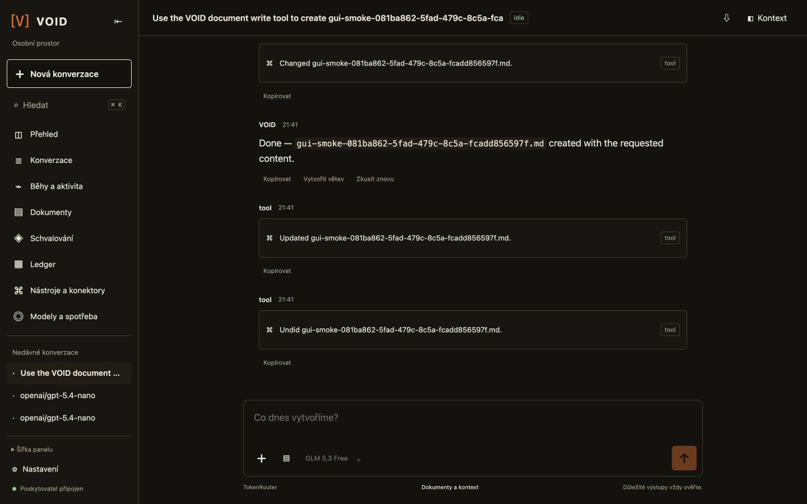
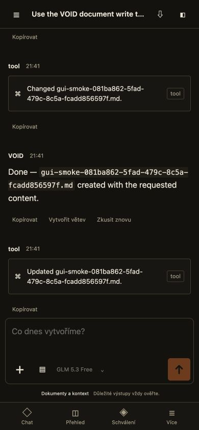

# GUI upgrade — předání 2026-09-11

Produkce: https://void-tui.vercel.app. Implementace na větvi `codex/gui-upgrade`.
Plán: [GUI-UPGRADE-PLAN.md](GUI-UPGRADE-PLAN.md), původní audit: [GUI-UPGRADE-AUDIT.md](GUI-UPGRADE-AUDIT.md).

## Dodané chování

- Společná React aplikace pro Vercel, lokální server a desktop. Vlastní paper-terminal styl, světlý/tmavý/systémový vzhled, čeština/angličtina, adresovatelné stránky a konverzace.
- Desktopová navigace a kontext s nastavením šířky; mobilní navigace, drawer, modal kontext, safe area a composer v ohraničeném viewportu.
- Chat: Markdown, tabulky, kód s kopírováním a stažením, streaming, skutečné stavy nástrojů, drafty, textové přílohy, výběr modelu a oblíbené modely. Větvení a retry vytváří bezpečnou větev bez přehrání historických nástrojů.
- Přehled, konverzace, běhy, dokumenty, schvalování, ledger, konektory, modely/spotřeba a nastavení. Sdílená tabulka poskytuje serverové hledání, řazení, stránkování, sloupce, uložené pohledy a export stránky. Ledger má scope, filtry, podpisy a detail návazností.
- Dokumenty: editace s očekávanou revizí, konflikt 409, historie a diff; Undo používá aktuální preview a kontrolu digestu. Editor po Undo načte skutečnou novou revizi.
- Konektory: přidání, editace, test připojení a skutečný katalog nástrojů se schématy. Prázdný token při editaci zachová existující tajemství.
- Cloud uchovává append-only events samostatně; metadata polling nepřenáší celý transcript. Delta stránky a klientské sloučení zabraňují duplicitám. Starší zachovaná historie je dostupná přes serverové dotazy.
- Výchozí nové konverzace: **TokenRouter / GLM 5.3 Free**, ID `z-ai/glm-5.3-free`. Ověřen skutečný katalog 137 modelů. Klíč je serverový; nepřechází do klientského buildu. Existující sessions zachovávají původní provider/model. Není zaveden tichý placený fallback.
- OpenAI-compatible stream parser zvládá rozdělené UTF-8/CRLF, tool fragments, redakci klíče a neúplný stream. Chyby providera včetně 429 mají konkrétní stav; generace se automaticky neopakuje.

## Ověření

| Důkaz | Výsledek |
|---|---|
| `pnpm run typecheck` | Prošlo včetně nového UI |
| `pnpm test` | 514 testů, 10 sad, bez chyby |
| Lokální a zabalený desktop runtime | Obě varianty prošly; zabalená varianta používá sdílený hashovaný web build |
| Build Vite, Nitro a Vercel | Prošly, produkční deployment READY |
| Izolovaný cloud dataset | 151 sessions, přes 1000 events, 10 000 podepsaných ledger records; staré záznamy a další stránky dohledány |
| Preview skutečný TokenRouter | Generace, tool write, idempotence, editace, konflikt, Undo a ověřený ledger prošly |
| Produkční skutečný TokenRouter | Prošlo: default, živá generace, tool write, idempotence, revision conflict, Undo, 4 ověřené signed records a events; session `b12bdd00-4a11-4441-acc3-95947bf65916` |
| Rozměry shellu | 320×568, 390×844, 430×932, 768×1024, 1024×768, 1280×720, 1440×900, 1920×1080; bez overflow dokumentu, composer uvnitř viewportu |
| Mobilní overlay | Background inert, focus uvnitř a návrat focusu; zkontrolováno v browseru |
| Kontrast základních tokenů | Text/muted/action v obou tématech minimálně 4,87:1; nejde o kompletní WCAG audit |
| JS rozpočet | Hlavní bundle přibližně 138 KB gzip, oddělený lazy highlighter přibližně 55 KB gzip |

Reprodukce cloudového smoke: `node scripts/src/verify-gui-deployment.mjs <VOID-deployment-url> <ignored-secret-json> run`. Vyžaduje autorizované Vercel CLI a JSON s `VOID_CONTROL_TOKEN`. Vytvoří jednu testovací session a dokument, upraví jej a vrátí změnu. `resume` pokračuje v již založeném smoke bez opakované generace. Přístupové údaje a výsledný session locator jsou ignorované soubory, ne součást repozitáře.

## Release a návrat

Produkční deployment: `dpl_CpxkQUbXepCDeRyhYtvfLkxuU4kc`, https://void-dj19pj0rs-sitespot.vercel.app.
Samostatný produkční build používá produkční prostředí. Izolovaný preview nebyl promován do produkce: měl vlastní databázi a tajemství.

Migrace je aditivní; produkce měla před změnou 11 sessions a žádný aktivní běh. Backfill zachoval 25 existujících events. Nastavení před migrací bylo lokálně zálohováno do ignorovaného souboru s právy 0600. Nová preview databáze je oddělená databáze na existujícím Neon endpointu, nikoli samostatná Neon branch.

Předchozí produkční deployment pro návrat: `dpl_BBh53V4VMvZvMKAJbz7BCxkScseV`. Při regresi vrátit tento deployment přes Vercel rollback po kontrole aktivních Workflow; nesmazat nové tabulky ani ledger. Samotný rollback nebyl proveden, aby se nepřerušovala funkční produkce.

## Přesné limity a otevřené ověření

- Textové přílohy mají společný limit 24 KB. Binární soubory, multimodální inference a privátní objektové úložiště nejsou součástí tohoto releasu.
- Zůstává jeden aktivní cloudový běh. Nejde o novou trvalou frontu ani souběžné agenty.
- Lokální úložiště dál zapisuje šifrovaný snapshot; běhy a usage jsou projekce zachovaných dat, nikoli nové inkrementální analytické tabulky. Historicky již ořezaná data nelze obnovit.
- Ceny a kapacity, které provider nevrací, UI označuje jako neznámé. Označení Free pochází z modelového katalogu, není vlastní garance trvalé ceny.
- Návrh je inspirován pracovními postupy Claude/OpenCode; nejde o tvrzení úplné funkční parity. Metadata projektů/tagů nejsou kompletní projektový management.
- Rozměry byly ověřeny v dostupném browseru. Fyzický iOS/Android, jejich softwarová klávesnice, všechny browser enginy, screen reader a kompletní 200% zoom audit zůstávají k ověření. LCP/INP/CLS z plánu jsou cíle, ne naměřený produkční výsledek.
- Preview narazilo na throttling Vercel Workflow event API s Retry-After 120 s. Durable běh po několika minutách sám pokračoval, nástroj se neopakoval a následný smoke prošel. Platforma může prodloužit čekání i při funkčním provideru.

Skilly caveman a ponytail byly již instalované a použité: stručná komunikace a opětovné využití stávajícího runtime, komponent a nativních dialogů. Instalace duplicit nebyla potřebná.

## Obrazové důkazy

Aktuální produkční konverzace po skutečné generaci, editaci a Undo:

