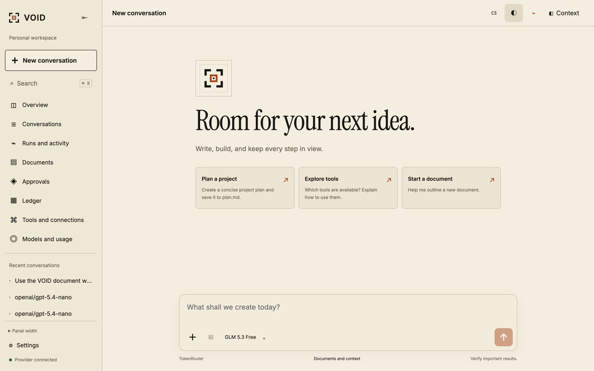
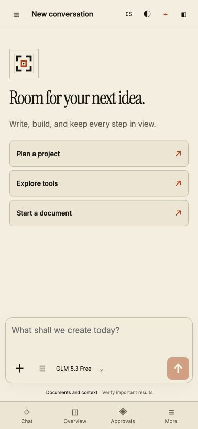

# Visual refinement — 2026-09-11

Production: https://void-tui.vercel.app. Deployment `dpl_G6to5pSvCNZVxM6vqK9e3pekAYqB` is READY; build took 15 seconds. Exact URL: https://void-5btdfhuu8-sitespot.vercel.app.

Post-deploy authenticated API smoke passed (provider, preferences, sessions, documents, runs, usage, overview, connectors). TokenRouter returned 137 models and GLM remained the default. The deployment error-log query returned no entries at verification time.

## Changes

- Replaced the invented ASCII marks with the exact aperture SVG geometry from `Dawe583/void-empty`, commit `25b5e62d49d614f88804b72b55609c74092d98d8`. Reused its original favicon. Same mark appears in the sidebar, welcome view and connection gate.
- Self-hosted the reference website's Instrument Serif, Inter and JetBrains Mono, including Czech glyphs. Refined headline scale, spacing, navigation selection, composer focus, message shapes, tables, dialogs and context panel.
- Added welcome/aperture reveal, actionable starter cards with prompt previews, card/arrow hover feedback, navigation feedback, page/message entrances, panel/dialog/backdrop transitions, detail expansion and true running-state pulse. No motion dependency added.
- Header controls switch English/Czech, light/dark, and motion. Motion respects the OS reduced-motion setting and the explicit toggle. No fabricated live data or looping decorative telemetry.
- English defaults for fresh browser storage. Full application chrome, metadata title, labels and settings have English variants. Fixed language selector and status messages that previously retained Czech after a language change. User-authored content and provider/tool payloads remain original.
- Access token remains private. The production browser is authenticated through the existing secure HttpOnly session rather than exposing a shared secret in the JavaScript bundle. Session expiry remains eight hours; other browser profiles require their own login.

## Verification

- UI typecheck and all 514 repository tests passed.
- Vite build passed: main JavaScript about 139 KB gzip; fonts self-hosted, requested by glyph range.
- Browser widths 320, 390, 768, 1024, 1440 and 1920: no document overflow; composer remains within viewport.
- Checked English settings, prompt-card insertion and textarea focus, exact SVG paths, context open/close, theme switch and animation disable (`animation-name: none`).
- Physical phones and all browser engines were not tested in this refinement.

Screenshots show the production UI, not an image mockup:

