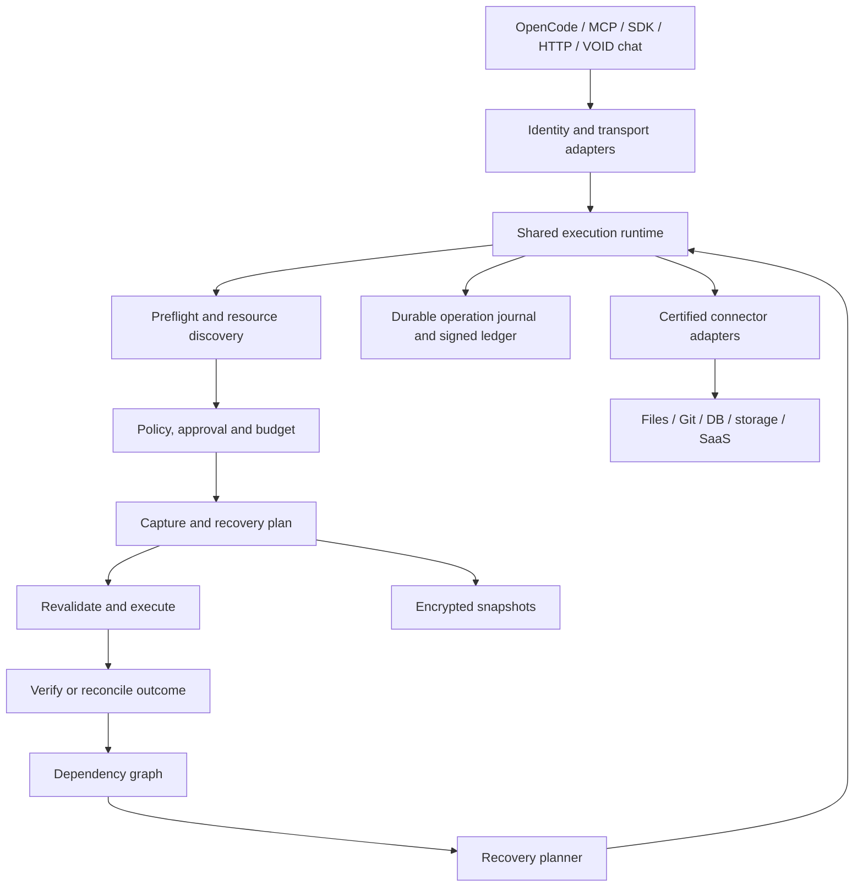

# VOID: plán dokončení vrstvy pro obnovu po AI agentech

Stav: návrh k následné realizaci, nikoli seznam již hotových funkcí.
Datum: 2026-09-11.
Výchozí implementace: `Dawe583/void`, commit `86ad0488c7d19bae9b733cc5da42f91d2e661821`.
Produktová reference: `Dawe583/void-empty`, commit `25b5e62d49d614f88804b72b55609c74092d98d8`.

## 1. Cíl a rozhodnutí

VOID bude samostatná vrstva mezi libovolným podporovaným agentem a systémy, do kterých zapisuje. Každou zachycenou operaci propojí s identitou, skutečným cílem, ověřenými podmínkami, předchozím stavem, rozhodnutím, výsledkem a proveditelným plánem obnovy. Obnova jedné akce, běhu nebo incidentu poběží přes stejnou kontrolovanou cestu a vytvoří vlastní podepsanou evidenci.

„Na všechno“ znamená společný protokol pro všechny nástroje a postupně širokou sadu ověřených adaptérů. Neznamená slib vrátit doručenou zprávu, zapomenout již přečtená data nebo zvrátit definitivní externí vypořádání. Nepodporovaná akce musí být viditelná jako nepodporovaná, nikdy vydávaná za obnovitelnou.

Výsledkem má být nástroj použitelný z OpenCode, Claude Code, dalších MCP klientů, TypeScript/Python aplikací i webového chatu VOID. Web zůstává ovládáním stejného jádra. Úspěch této práce nebude posuzován podle vzhledu GUI/TUI.

Rozhodnutí pro realizaci:

1. Prioritou je skutečná cesta zápisu a obnovy. Další redesign ani nové chatové funkce nejsou závislost.
2. Zachovat registry, ledger, policy, konektory a existující testy. Přidat společný runtime namísto další implementace v každém hostiteli.
3. První úplně ověřená cesta: OpenCode/MCP nebo SDK, řízený zápis do PostgreSQL, restart VOID, ověřené Undo.
4. Ihned poté filesystem/Git a GitHub, protože jde o běžné zásahy coding agentů. Následují S3/Supabase a Vercel.
5. Obnova stavu, obnova s viditelnou stopou, kompenzace a nevratnost budou oddělené výsledky.
6. Rozšíření na další služby bude využívat stejný kontrakt a certifikační testy, nikoli další izolované „Undo“ implementace.
7. Model může vysvětlovat a navrhovat. Sám neurčuje důvěryhodnost snapshotu, povolení zápisu ani platnost inverse.
8. Vlastní chat zachová výchozí GLM 5.3 Free přes TokenRouter. Proxy a reverse engine budou nezávislé na modelu i providerovi.

## 2. Co přesně vyplývá z původního webu

Reference jsou připnuté na konkrétní commit; pozdější změna webu nebude nepozorovaně měnit specifikaci.

| Slib webu | Zdroj | Požadovaný výsledek |
|---|---|---|
| „intercepts every write“ | `pages/home.tsx:26` | Každý zápis přes podporovanou hranici vstoupí do společného runtime |
| MCP / SDK / HTTP / CLI | `lib/site-data.ts`, `mechanisms`, `codeSamples` | Více vstupních adaptérů se stejnou sémantikou |
| Preflight a měřený blast radius | `lib/site-data.ts`, `preflight`, `shadow` | Resource set, podmínky, přesnost měření a jeho platnost |
| Compensation compiler | `lib/site-data.ts`, `compensation` | Deterministický plán z certifikované šablony a zachyceného stavu |
| Saga ledger | `pages/spec.tsx`, `pages/docs.tsx` | Podepsaný životní cyklus intentu, execution a recovery |
| Time scrubber, cross-system replay | `pages/spec.tsx`, sekce Replay semantics | Trvalý plán obnovy s pořadím, kontrolou konfliktů a výsledkem každého kroku |
| Cross-agent taint graph | `lib/site-data.ts`, `taint`, `taintNodes` | Prokazatelné datové závislosti i konzervativní vazby přes resource |
| Provisional receipt a cascading cancel | `lib/site-data.ts`, `hold` | Pozdější volitelný staged režim; standardní klient zůstává blokující |
| Denní R3 budget | `pages/spec.tsx`, sekce Irreversibility budget | Atomické rezervace napříč agenty a procesy |
| Shadow, preflight, compensate, enforce | `lib/site-data.ts`, `rollout`; `pages/docs.tsx` | Postupné zavedení s jasnými garancemi každého režimu |
| Ověřitelná evidence | `pages/attestation.tsx`, `pages/security.tsx` | Offline ověření podpisů, časového pořadí a vazeb na recovery |

Zdrojové odkazy:

- [Produktový text a mechanismy](https://github.com/Dawe583/void-empty/blob/25b5e62d49d614f88804b72b55609c74092d98d8/artifacts/void/src/lib/site-data.ts)
- [Specifikace webu](https://github.com/Dawe583/void-empty/blob/25b5e62d49d614f88804b72b55609c74092d98d8/artifacts/void/src/pages/spec.tsx)
- [Dokumentace webu](https://github.com/Dawe583/void-empty/blob/25b5e62d49d614f88804b72b55609c74092d98d8/artifacts/void/src/pages/docs.tsx)
- [Hlavní stránka](https://github.com/Dawe583/void-empty/blob/25b5e62d49d614f88804b72b55609c74092d98d8/artifacts/void/src/pages/home.tsx)

### Rozpory ve webu, které je nutné rozhodnout před implementací

- Specifikace zmiňuje vzorkování širokých zásahů, jiný text slibuje přesné měření. Výsledek bude mít `exact`, `bounded` nebo `unknown`. Vzorek nikdy nebude prezentovaný jako přesný počet ani automaticky splňovat limit.
- Read-only operace podle jedné části přeskakují pipeline, ale taint potřebuje jejich původ. Čtení dostane lehkou evidenci provenience; nebude potřebovat before snapshot. Export citlivých dat není automaticky neškodný jen proto, že používá GET.
- Snapshot souběžný se zápisem je přípustný jen při prokázaném čtení konkrétní předchozí revize. Jinak se musí durable capture dokončit před dispatch.
- Příklady typu kalendář s oznámením účastníkům nebo rollout s již obslouženými požadavky nesmějí automaticky dostat R0. Obnovit konfiguraci neznamená odstranit všechny externí následky.
- LIFO je výchozí pořadí nezávislých akcí. Skutečné závislosti mají přednost; použije se obrácené topologické pořadí.
- Ilustrační latence 8 až 40 ms ani počty „tools with inverses“ nejsou existující benchmark nebo implementované konektory.
- Původní `CONTEXT.md` říká, že VOID žádné volání neiniciuje. Upřesnit: VOID nevymýšlí původní business intent, ale autorizovaný recovery runtime provádí inverse a kompenzace.

## 3. Výchozí stav a mezery

Dosavadní audit: 404 testů jádra, 524 širších regresních testů a 10 dalších OAuth/REST testů. Čísla jsou historická evidence před tímto plánem. Neprokazují realizaci níže uvedených funkcí. PGlite je skutečný SQL engine; fake S3 klient není test proti AWS.

| Oblast | Dnes | Co chybí |
|---|---|---|
| MCP proxy / policy | Intercept, allow/hold/deny, evidence rozhodnutí | Společná atomicky řízená sekvence capture, dispatch, outcome, recovery |
| Managed dokumenty | Capture, podepsané Undo, drift a ABA ochrana | Použít jako referenční adaptér společného runtime |
| PostgreSQL | Omezený capture/inverse UPDATE/DELETE, transakční apply | Integrovaný původní zápis, INSERT, revision tracking, real-server fault testy |
| S3 | Before bytes, snapshot, podmíněná kompenzace | Version-aware operace, metadata, retention a skutečné cloudové testy |
| CLI replay | Ověřené podpisy a capture binding | Vlastní signed receipt recovery, více operací a trvalý recovery job |
| Taint | Graf z resource a dostupných digestů | Automatické resource/read/write metadata, provenance přes běhy a agenty |
| Cloud chat | Vlastní execution loop a ledger | Delegování na společný runtime, žádná druhá policy/recovery implementace |
| OAuth | Mechanismus připojení tří služeb | Dokončený souhlas účtů a samostatné recovery capability pro jednotlivé operace |
| R3 budgets | Produktový koncept | Trvalé rezervace, účetnictví a vynucení napříč workery |
| Provisional hold | Blokující schválení | Staged výsledky, dependency barrier, cascading cancel |
| Libovolný shell/HTTP | Není obecně vratný | Izolovaná hranice, adaptéry, označení nepozorovaných účinků |

Aktuální zdroje: `packages/proxy/src/forward/tools.ts`, `packages/proxy/src/bin.ts`, `packages/connectors/src/registry.ts`, `packages/cli/src/replay.ts`, `packages/ledger/src/taint/{capture,graph,query}.ts`, `packages/workbench/src/workspace.ts`, `cloud/{server,steps,store,integrations}.mjs` a [zpráva z auditu](./REVERSE-ENGINE-VALIDATION.md).

Existující graphify mapa pomohla s orientací v původních kontraktech. Není důkazem aktuální implementace; závěry byly ověřeny proti současným souborům a auditu.

## 4. Definice garancí

### Tři nezávislé osy

1. `effect`: read, write, external-disclosure, mixed, unknown.
2. `reversibility`: R0 přesná obnova v deklarované hranici bez externí stopy; R1 obnova stavu se stopou; R2 zmírnění následků; R3 bez použitelné cesty zpět.
3. `readiness`: verified, conditional, expired, unsupported, unknown-outcome, conflict.

Neznámá operace není prokázaná R3. Interně zůstane `unknown`, policy se k ní chová nejméně tak přísně jako k R3. Registry musí oddělit deklarovanou schopnost od právě dostupné a ověřené schopnosti. R0 není synonymum GET ani nízkého rizika.

Každá garance má `scope`: například bytes souboru, obsah Git stromu, vybrané sloupce řádků, aktuální obsah objektu nebo konfigurace deploymentu. Vedle toho explicitní nezahrnuté účinky: webhooky, emaily, sequence values, externí cache, logy, již přečtená data.

Snapshot obnovu umožňuje pouze při dostupném a otestovaném apply a verify. Existence JSONu nebo názvu „inverse“ sama nedokazuje obnovitelnost.

### Povinné invarianty

- V režimu vyžadujícím recovery žádný chráněný zápis bez durable capture a odpovídajícího evidence bindingu.
- Argumenty, cíl, verze adaptéru, policy a plán tvoří jeden podepsaný execution digest.
- Schválení nepřežije změnu argumentů nebo relevantního stavu bez opětovného vyhodnocení.
- Úspěšná odpověď HTTP sama nedokazuje business postcondition; ověření je součástí kontraktu adaptéru.
- Timeout po dispatch znamená neurčitý výsledek, ne „nic se nestalo“.
- Restart ani timeout nevyvolá opakovaný zápis bez bezpečné idempotence nebo reconciliation.
- Undo nikdy tiše nepřepíše novější lidskou změnu. Konflikt zůstává konfliktem.
- Recovery nevydává R2 za Undo a R3 za vyřešené.
- Ledger je append-only. Recovery přidává nové události, nemaže historii původní operace.
- Smazaný či poškozený snapshot zneplatní recovery readiness.
- Lokální proces bez síťové izolace neumí garantovat zachycení operací mimo VOID.

## 5. Cílová architektura

### Rozdělení kódu

- Nový `packages/runtime`: životní cyklus, recovery jobs, scheduler, idempotence a hostitelské kontrakty. Opodstatnění nového balíčku: nejméně proxy, SDK a cloud budou sdílet tutéž implementaci.
- `packages/registry`: čistá metadata, klasifikace a capability schema; bez síťových závislostí.
- `packages/connectors`: preflight, capture, execute, reconcile, planRecovery, applyRecovery, verifyRecovery podle konkrétní služby.
- `packages/policy`: rozhodnutí a approval lifecycle; přibude budget kontrakt. Úložiště účtu budgetu bude implementovat hostitel/runtime.
- `packages/ledger`: verzované signed event schema, linkování operací, recovery evidence, provenance, offline export.
- `packages/proxy`, `packages/sdk`, `cloud/steps.mjs`: transport a orchestrace hostitele; žádný samostatný algoritmus Undo.
- Lokálně jeden durable writer a existující snapshot store. Cloud využije stávající Neon, Vercel a Workflow. Žádný nový Kafka/Redis cluster jen kvůli tomuto plánu.
- Lokální executor běží u chráněných souborů a nástrojů. Vercel nemá přímý přístup k lokálnímu disku; případný remote control používá autentizované odchozí spojení executoru a omezené capabilities.

### Datový model

| Entita | Povinná data |
|---|---|
| Operation | operationId, workspaceId, agentId, runId, parentId, tool identity, connector version, idempotency key, canonical argument digest |
| Resource observation | stabilní resource key, read/write fields, observed revision, source, timestamp, expiry, coverage |
| Preflight | effect, R class, readiness, blast radius, precision, required capabilities, policy version |
| Capture | snapshot reference/digest, format version, encryption key id, scope, retention deadline, before revision |
| Execution | prepared digest, approver binding, dispatch attempt, provider request id, output digest, observed after revision, outcome |
| Dependency | producer, consumer, resource/field, explicit/observed/conservative confidence, příčina vazby |
| Recovery plan | planId/digest, selection boundary, dependency closure, ordered steps, preconditions, cost, irreversible residuals |
| Recovery job | operator, plan digest, authorization, checkpoint, step outcomes, verification, lease generation |
| Budget reservation | workspace/agent/window, operation or group id, reserved/spent/released/uncertain, reason |

Citlivý obsah a přístupové tokeny nepatří do veřejného ledgeru. Snapshot musí uchovat data potřebná k obnově v šifrovaném úložišti; redigovaný auditní náhled je jiný objekt. Nelze tajně odstranit potřebná data ze snapshotu a dál slibovat stejnou obnovu.

### Životní cyklus

`received -> preflighted -> awaiting_approval/authorized -> captured -> prepared -> dispatched -> succeeded/failed/unknown`.

Po schválení i bezprostředně před dispatch se ověří relevantní revision a podmínky. Dlouhý hold nesmí znamenat dlouhou otevřenou DB transakci. Po změně cíle se obnoví preflight, snapshot a případně souhlas. Read-only větev nepoužívá mutation capture.

Recovery: `planned -> approved -> applying -> verifying -> restored/compensated/partial/conflict/unknown/failed`.

Journal uchová záměr před dispatch a výsledek po něm. Pro externí služby nelze atomicky spojit síťový commit s lokálním ledger appendem. Výpadek v této mezeře zůstane `unknown`; reconciler hledá provider receipt, idempotency result nebo ověřitelnou revizi. U vlastního PostgreSQL executoru lze cílový zápis a jeho outbox zapsat v jedné transakci; přenos a podpis v centrálním ledgeru zůstává samostatný krok.

## 6. Pracovní balíčky a pořadí

Každý balíček musí dodat implementaci, testy, migraci nebo kompatibilitu, krátký provozní popis a strojově čitelný důkaz exit kritéria. Následující názvy nových souborů a příkazů jsou plánované, nikoli již dostupné API.

### WP-R00: Sjednotit smlouvu produktu

- Aktualizovat `docs/CONTEXT.md`, `docs/DECISIONS.md`, package README a schema registry podle části 4.
- Vytvořit `docs/RECOVERY-CONTRACT.md` a `docs/RECOVERY-COVERAGE.md` s klasifikací jednotlivých operací.
- Oddělit connector „connected“ od „recovery certified“. Příklady webu s přehnanou klasifikací převést do ověřitelných podmínek.
- Ověřit exportovaný `Connector` v `packages/connectors/src/index.ts` proti runtime kontraktu v `registry.ts`; nevytvořit třetí odlišný interface.
- Exit: každá podporovaná akce má přesný scope, failure režim a referenci na test; žádný příklad neprohlašuje registry metadata za existující inverse.
- Závislosti: žádné. Velikost: S.

### WP-R01: Operation journal a signed lifecycle

- `packages/runtime/src/{operation,journal,reconcile}.ts`, změny `packages/ledger/src/{store,feed,verify}.ts`, `cloud/store.mjs`.
- Zavést stabilní operationId, request digest, dispatch attempt, output digest a outcome unknown.
- Lokální writer a cloud transaction adapter musí zachovat identické přechody. Unikátní klíč idempotence odmítne stejné ID s jinými argumenty.
- Staré podepsané události se nepřepisují. Legacy replay zůstává inspect-only, pokud chybí nové bindings.
- Exit: fault injection před/po každém persistence kroku; po restartu žádný falešný success ani neřízený druhý dispatch.
- Závislosti: R00. Velikost: L.

### WP-R02: Společná execution pipeline

- `packages/runtime/src/{execute,adapter}.ts`; zapojit skutečné dispatch hranice v proxy, SDK, workbench a cloud.
- Metadata nástrojů normalizovat přes explicitní mapování identity a schema. Názvu `update` ani reklamnímu MCP annotation se nevěří.
- Implementovat prepare, preflight, capture, durable plan binding, revalidate, execute, verify a reconcile.
- Capture failure v enforce-recoverable musí zabránit forwardu. U známé nevratné akce vytvořit explicitní plán „no inverse“, approval a budget.
- Exit: stejná conformance sada projde přes stdio MCP, HTTP MCP, SDK a cloud runtime. Jeden test výslovně dokáže, že snapshot selhal a upstream nebyl zavolán.
- Závislosti: R01. Velikost: XL.

### WP-R03: Snapshots jako garantovaná závislost

- Rozšířit `packages/connectors/src/snapshot/*` a `manifest.ts` o pinning pro aktivní operace a recovery jobs, expiraci, formátové verze a key id.
- Před mutation rezervovat kapacitu pro capture a evidenci recovery. Otestovat kvóty a velké objekty se streamingem.
- Oddělit audit retention a recovery retention. GC nesmí smazat pinovaný snapshot.
- Ověřit digest při čtení, šifrovaný restore po restartu a rotaci klíče; ztráta klíče se projeví jako nedostupná obnova.
- Exit: plný disk, přerušený upload, přerušený rename a retence během Undo nezpůsobí falešně dostupný plán.
- Závislosti: R01; finální integrace s R02. Velikost: L.

### WP-R04: PostgreSQL end-to-end

- Rozšířit `packages/connectors/src/postgres/{capture,parse,inverse,replay}.ts`; přidat řízený executor a revision/outbox metadata.
- Nejprve strukturované INSERT/UPDATE/DELETE podle PK, explicitní sloupce, podporované cascade a reálné before/after images. Teprve potom rozšiřovat SQL parser.
- Zachycení a původní změna běží v jedné řízené transakci, kde je to možné. Libovolné SQL předané cizímu MCP serveru tuto garanci nedostane automaticky.
- AFTER/BEFORE triggery, GENERATED sloupce, RLS, tenant scope, FK a sekvence ověřit zvlášť. Neznámý trigger s externím účinkem snižuje garanci.
- Zavést revision/CAS ochranu včetně ABA. Samotná shoda values nebo `xmin` jako trvalý univerzální identifikátor nestačí.
- DDL rollback před COMMIT odlišit od obnovy po COMMIT. DROP/TRUNCATE bez explicitní strategie je nevratný nebo vyžaduje branch/backup restore s jiným scope.
- Exit: skutečný PostgreSQL server, dvě connection, deadlock, serialization failure, cascade, rollback při constraint error, restart a ztracená COMMIT odpověď. Porovnat data i deklarované schema/metadata; ne jen HTTP status.
- Závislosti: R02, R03. Velikost: XL.

### WP-R05: Filesystem a Git pro coding agenty

- Nové adaptéry `packages/connectors/src/{filesystem,git}/`.
- Filesystem: create/write/delete/rename, bytes, mode a symlink semantics v explicitním workspace. Chránit traversal, symlink escape, citlivé cesty a souběžné externí změny.
- Rozlišit obnovu obsahu od identity souboru, hardlinků, ACL a xattrs. Podporované metadata explicitně vyjmenovat.
- Git: sledovat working tree, index i untracked soubory; nespoléhat jen na `git diff HEAD`. Zachovat změny uživatele existující před akcí.
- Public commit obnovovat revert commitem nebo recovery PR. Žádný automatický force-push či reset sdílené historie.
- Shell command sítě/DB/cloud side effects neoznačit za vratný jen proto, že byl snapshot pracovního adresáře.
- Exit: více kroků agenta, rename/delete/binární soubor, necommitované lidské změny, konflikt i restart; Undo vrátí pouze vlastní rozsah změn.
- Závislosti: R02, R03. Velikost: L.

### WP-R06: Trvalý recovery planner a runner

- `packages/runtime/src/recovery/{plan,run,verify}.ts`, `packages/cli/src/replay.ts`.
- Výběr operation/run/checkpoint/time. Čas se převede na uloženou sekvenční hranici workspace; nerozhodují nesynchronizované klientské hodiny.
- Dry-run vypíše přesné targets, inverse, prerequisites, konflikty, ztracené snapshots a nevratné zbytky.
- Approval se váže na digest celého plánu. Nové závislé zápisy po náhledu způsobí replan; žádné tiché rozšíření scope.
- Trvalé checkpointy, resource locks a lease generace chrání proti dvěma recovery workerům. Lokální lease není důkaz, že externí služba podporuje fencing.
- Výchozí politika při konfliktu zastaví závislou větev. Nezávislé větve pokračují jen při explicitní volbě v plánu.
- Každý apply i konečné ověření přidá signed receipt `reverses` původního operationId.
- Exit: opakovaný stejný job nezpůsobí druhý účinek; kill workeru uprostřed obnovy je bezpečně rozlišen na completed/unknown/pending.
- Závislosti: R02, R03, nejméně jeden adaptér R04/R05. Velikost: XL.

### WP-R07: Provenance a cross-agent závislosti

- Rozšířit `packages/ledger/src/taint/*`, registry resource selectors a metadata runtime.
- Zapisovat resource keys, read/write sets, pozorované revize a explicitní receipt inputy. Output digest bez zaznamenaného použití nestačí k úplné kauzalitě.
- Rozlišit potvrzenou datovou vazbu, pozorovanou resource vazbu a konzervativní potenciální závislost. Shodný text není důkaz příčiny.
- Dotazy/predikáty vyžadují rozsah nebo konzervativní query dependency. Bez něj nelze tvrdit kompletní tracking všech ovlivněných čtení.
- Planner vypočte descendant closure a obrácené topologické pořadí. U nevratného potomka zobrazí residual impact; neprohlásí celý incident za obnovený.
- Exit: dva až tři agenti přes více sessions změní a přečtou stejný resource; graf najde skutečné downstream kroky, nezamění identické hodnoty jiných tenantů a odmítne neúplnou jistotu.
- Závislosti: R01, R02; integrace s R06. Velikost: XL.

### WP-R08: S3 a Supabase storage/database

- S3: versioned put/delete, přesné versionId/delete marker, bytes a podporovaná metadata. Restore konfigurace/history má samostatné garance.
- Ověřit Object Lock, legal hold, retention, multipart, šifrování a podmíněné zápisy. Bez versioning je bytes restore kompenzace s jiným profilem.
- Supabase DB reuse PostgreSQL adaptéru pouze tam, kde existuje řízený database access; samotný management OAuth neznamená právo číst libovolné tabulky.
- Supabase Storage se ověřuje samostatně. Nepřenášet automaticky všechny S3 garance na S3-compatible rozhraní.
- Větší migrations řešit branch/staging, schváleným apply a recovery strategií; down migration nemusí vrátit ztracená data.
- Exit: izolovaný skutečný AWS bucket a Supabase test projekt, změna/obnova plus souběžný writer; conformance v emulátoru je pouze předběžná brána.
- Závislosti: R02, R03, R06; DB větev R04. Velikost: XL.

### WP-R09: GitHub a Vercel recovery

- GitHub: soubor/commit, branch, issue/PR metadata, merge. Před změnou uchovat SHA a relevantní fields; po změně provider IDs a nový head.
- Pro merge nabídnout recovery PR s revert commitem. Webhooky, CI, review a přečtený obsah zůstávají stopou.
- Vercel: capture konfigurace, vybraných env proměnných v šifrovaném snapshotu, aliasů a předchozího deployment targetu. Výpis pro model nadále redigovaný.
- Redeploy, repoint alias a promote předchozí verze nejsou rollback databázových migrací ani již obsloužených requestů.
- Read-only test dostupnosti OAuth je oddělen od recovery certifikace. Revalidate scopes před inverse; odvolaná oprávnění znamenají blocked recovery.
- Exit: disposable repository a Vercel projekt; změna přes VOID, nový lidský commit, bezpečný conflict; samostatně ověřený návrat konfigurace/deployment targetu.
- Závislosti: R05, R06, dokončené OAuth souhlasy. Velikost: L až XL.

### WP-R10: Policy režimy a rozpočty nevratnosti

- Shadow: měří a eviduje, ale nevynucuje zákaz. Musí viditelně přiznat, že negarantuje snapshot ani blokování při failure. Selhání auditu bude hlášené jako coverage gap.
- Enforce: klasifikace, capture požadavky, approval a atomický budget. Režim require-recoverable odmítne operace bez ověřené požadované obnovy.
- Rezervace per agent/workspace/window, potvrzení při dispatch podle zdokumentované semantiky, release jen po jistém neprovedení; unknown drží rezervaci.
- Pro deklarovaný víceakční plán rezervovat skupinu před prvním zápisem. U otevřeného agentního běhu nelze dopředu slíbit rozpočet na ještě neznámé kroky.
- Výchozí okno UTC; změna timezone či limitu nesmí umožnit dvojí denní čerpání. Ruční top-up je auditovaná událost.
- Vyčerpání budgetu dovolí pouze skutečné bezpečné čtení, nikoli libovolný GET/export.
- Exit: 100 souběžných žádostí při limitu 2 nepovolí 3. Restart, retry, dva workery a unknown response nevynulují spotřebu.
- Závislosti: R01, R02. Velikost: L.

### WP-R11: Staged hold a cascading cancel

- Zachovat dvě odlišné funkce: approval hold vyžaduje explicitní souhlas a po expiraci odmítá; delayed commit může po časovém okně commitnout jen podle předem povolené policy.
- Provisional receipt není fingovaný úspěšný výsledek cílové služby a nenahrazuje reálné resource ID.
- Transparentní MCP klient dál čeká. Provisional workflow vyžaduje schopný SDK/hostitel a oddělenou staged resource vrstvu.
- Závislé zápisy nesmějí uniknout do reálného systému před potvrzením jejich předků. Cancel odstraní staged descendants; již provedené kroky řeší běžný recovery planner.
- Perzistentní deadline, budget reservation, signed state a opakovaný preflight před commit.
- Exit: parent cancellation zruší celý staged podgraf, ani jeden externí write se neprovede; restart nesmí změnit approval hold v auto-commit.
- Závislosti: R06, R07, R10. Velikost: XL, až po stabilním blokujícím režimu.

### WP-R12: Rozšiřitelný adapter SDK a další služby

- TypeScript `wrap()` a `adapter()` podle ducha webu, Python klient se stejným wire protokolem. Nevytvářet druhý nezávislý reverse engine v Pythonu.
- Generický HTTP wrapper zaznamená volání a použije zaregistrovaný adapter; z HTTP metody sám nesestavuje inverse.
- `void adapter test` provede capture/execute/recovery/verify, drift, retry a interruption sadu v sandboxu.
- Capability manifest váže tool schema digest, verzi adaptéru, permissions, inverse template a úspěšné testy.
- AI návrh adaptéru se stane executable pouze po kontrole a conformance testech. Neověřený generovaný kód se nespouští s produkčními credentials.
- Další vlny: CRM record create/update/archive; email draft/delayed send; calendar bez/ s notifications; Slack draft/post; Stripe sandbox cancel/refund/settlement; Kubernetes deklarativní konfigurace.
- U komunikace a financí budou převažovat prevence a kompenzace. Každý tool má vlastní ověřené provider chování; „refund inverse“ se nevymýšlí.
- Exit: nový jednoduchý adapter přidat bez změny jádra; provider drift změní stav na uncertified, ne na green.
- Závislosti: R02, R06; širší vlny podle priority. Velikost: L pro SDK, průběžná pro služby.

### WP-R13: Vynutitelná hranice a integrace hostitelů

- `void doctor/init` inventarizuje nakonfigurované MCP/tool surfaces, ověří dostupné capabilities a ukáže nechráněné cesty.
- OpenCode jako první konkrétní host, poté další MCP klient a TS/Python SDK. Konfigurace má backup, dry-run a bezpečnou obnovu původního nastavení.
- Kooperativní režim explicitně negarantuje zachycení přímého shellu, curl, SSH nebo jiných credentials.
- Volitelný managed executor/container drží service credentials mimo agenta a vynucuje síťový egress přes schválené adaptéry. Filesystem permissions vymezí zapisovatelný workspace.
- Shell snapshot chrání soubory uvnitř boundary, ne externí následky commandu. Browser write je chráněný jen přes instrumentovaný nástroj s adapterem, ne automaticky každým kliknutím.
- Exit: direct API bypass je v managed režimu zablokován; nepodporovaný OS/host režim je označen jako cooperative, nikoli „protected everything“.
- Závislosti: R02, R05; pokročilá izolace po R12. Velikost: L až XL.

### WP-R14: Evidence, provoz a veřejné pokrytí

- Offline bundle: signed lifecycle, trust roots/key rotation, snapshot/plan digests, selection boundary, execution a recovery receipts, residual impact.
- Ověření úplnosti používat přes checkpointy a expected sequence range; validní podpisy samy neprokazují absenci zatajeného konce historie.
- Snapshot availability a integritu auditních záznamů zobrazovat zvlášť. Retence nebo crypto erasure nesmí potají změnit tvrzení o obnovitelnosti.
- Metriky: capture latency/bytes, readiness, conflicts, unknown outcomes, reconciliation time, recovery success a connector/version coverage. Nízkou úspěšnost neschovávat vynecháním failed/unknown pokusů.
- Runbooky: expired credentials, poškozený snapshot, stale worker, disk full, ledger unavailable, key rotation, provider outage, částečná kompenzace.
- EN/CS web a dokumentace budou číst skutečnou capability matici. Ukázkové údaje zůstanou označené jako demo; nepřidávat neověřené compliance sliby.
- Exit: recovery po obnově backupu a rotaci klíče; nezávislý offline verifier odmítne změněný bundle. Doklady každého connector release jsou dohledatelné.
- Závislosti: R06, R07, R12. Velikost: L.

## 7. Milníky a kritická cesta

| Milník | Obsah | Co smíme tvrdit |
|---|---|---|
| M0: smlouva | R00 | Přesně definované recovery capabilities a známé mezery |
| M1: skutečné integrované Undo | R01, R02, R03, R04, minimální R06 | Zápis přes VOID do podporovaného PostgreSQL lze po restartu bezpečně obnovit |
| M2: coding agent | R05, dokončení R06, základ R13 | Podporované filesystem/Git změny mají evidované selektivní Undo |
| M3: incident napříč systémy | R07, R08, R09 | Jeden plán koordinuje podporované DB/storage/GitHub/Vercel kroky a přizná zbytky |
| M4: prevence a otevřené integrace | R10, R12, R13 | Vynucené budgets a rozšiřitelný ověřovaný adapter SDK |
| M5: původní pokročilá vize | R11, R14 | Staged receipt workflow, cascading cancel a ověřitelný provozní balík |

Kritická cesta: R00, R01, R02 + R03, R04, R06, R07, R11. R05 může následovat hned po stabilním kontraktu a běžet nezávisle na části DB testů. R10 lze stavět po R02, ale nesmí odsunout první skutečný recovery scénář.

Velikosti jsou odhady implementační složitosti: S přibližně 1 až 3 pracovní dny, L 1 až 2 týdny, XL 2 až 4 týdny soustředěné práce včetně ověřování. Není to příslib kalendáře. M1 odhadem 4 až 8 plných pracovních týdnů; širší M3 přibližně 10 až 18 týdnů kumulativně; M5 a rozšiřování služeb přibližně 4 až 8 měsíců nebo více. Při 25 hodinách týdně počítat s delší dobou. Odhady upravit po R02 podle reálných exit důkazů, ne podle rychlosti generování kódu.

Při realizaci maximálně dva subagenti podle uživatelova limitu. Delegovat samostatný adapter nebo adversarial test proti stabilnímu kontraktu; více autorů nemá současně přepisovat společný runtime. Tento plán sám nic nenasazuje a nespouští destruktivní integrační testy.

## 8. Ověřovací matice

Každá mutující capability musí projít společnou sadou a provider-specific sadou. Testy nesmí pouze kontrolovat, že byla zavolána funkce `undo`.

| Situace | Požadovaný důkaz |
|---|---|
| Create/update/delete bez konfliktu | Before/after/restore porovnání skutečného cíle v deklarovaném scope |
| Více operací nad jedním resource | Správné pořadí, selektivní obnova a zachování nezasažených polí |
| Agent A write, B read, C write | Provenance a descendant closure napříč sessions |
| Human edit po akci | Konflikt, žádný tichý overwrite |
| ABA změna | Revision evidence odhalí změnu i při stejných values |
| Capture unavailable/disk full/quota | Chráněný forward se neuskuteční |
| Snapshot missing/corrupt/wrong key | Recovery unavailable, žádné hádání náhradních dat |
| Snapshot GC při recovery | Pinning udrží potřebný snapshot |
| Změna argumentů po approval | Approval neplatí, replan/reapproval |
| Změna cíle během hold | Nový preflight, žádný starý count jako povolení |
| Crash před/po dispatch | Rozlišení neprovedeno/provedeno/unknown; žádný slepý retry |
| Externí success, ledger outage | Reconciliation/outbox zachová pravdivou evidence gap |
| Timeout/429/5xx | Retry pouze při prokázané bezpečnosti; unknown zůstane blokovaný |
| Dva workery stejného jobu | Žádný dvojí bezpečně známý efekt, stale worker nemění journal |
| Provider bez idempotence/CAS | Omezená garance je viditelná, žádné exactly-once tvrzení |
| Budget race/window reset | Limit nepřekročen napříč procesy, unknown rezervace zachována |
| Partial cross-system failure | Výsledek per step, residual impact, správná blokace závislé větve |
| Revoked OAuth nebo chybějící scope | Obnova odmítnuta před nepovoleným zásahem |
| Prompt injection v tool resultu | Data nemění policy, approvera ani recovery template |
| Tenant/resource substitution | Zabránění přenosu plánu nebo snapshotu do jiného workspace |
| Škodlivý adapter/schema drift | Neověřená capability se nevykoná jako certified inverse |
| R2 komunikace/R3 settlement | Přesná kompenzace nebo terminal report; žádný falešný „restored“ |
| CLI/SDK/cloud rozdíly | Stejné execution/recovery kontrakty pro shodný scénář |
| Obejítí přes shell/network | Managed boundary blokuje; cooperative režim přizná mezeru |
| Offline evidence tampering | Nezávislý verifier odmítne digest, podpis, pořadí nebo binding |

Testovací vrstvy:

1. Deterministické unit a property/state-machine testy s uloženým seedem.
2. Conformance suite pro každý adapter a každý transport.
3. Lokální integrace: skutečný PostgreSQL server, reálný filesystem/Git, S3 emulátor; PGlite zůstává rychlou regresní vrstvou.
4. Oddělené staging prostředky GitHub/Vercel/Supabase/AWS s testovacími daty. Žádné implicitní použití produkčních projektů z běžného účtu.
5. Fault injection: kill procesu, výpadek před/po COMMIT, přerušení streamu, síťové rozdělení, disk full a rotace klíčů.
6. Release evidence: uložený scope, adapter/provider verze, seed, příkazy, výsledky a residual limitations.

Stávající příkazy: `pnpm test:reverse`, `pnpm test`, `pnpm run typecheck`. Plánované runner příkazy k dodání: `pnpm test:recovery`, `pnpm test:recovery:integration`, `pnpm test:recovery:faults`, `pnpm test:adapter -- <id>`. CI nesmí považovat přeskočený live test za certified provider support.

Výkonnost měřit odděleně: CPU/policy overhead, probe latency, capture latency, commit latency, recovery throughput a p95/p99. Testovat malé operace i 1 000/10 000 záznamů podle schopností adaptéru. SLO stanovit po baseline; marketingových 8 až 40 ms není gate pro síťový snapshot velkých dat.

## 9. Referenční incident pro konečné převzetí

1. OpenCode přes VOID upraví lokální kód a provede podporovaný DB update.
2. Další agent přečte změněné DB údaje a upraví GitHub issue či připraví PR.
3. VOID uloží skutečné outputs, snapshots, resource revisions a meziagentní závislosti.
4. Test vloží lidskou změnu do jednoho z dotčených resources a přeruší runtime.
5. Po restartu operátor vybere checkpoint před chybným během.
6. Planner najde celý známý dopad, určí pořadí, vypíše lidský konflikt a nevratné externí stopy.
7. Schválený recovery job obnoví povolené části, konfliktní větev zastaví a nepřepíše lidskou změnu.
8. Opakování stejného jobu nevytvoří další nechtěné účinky.
9. Externí verifier ověří původní i recovery evidence bez přístupu k internímu VOID serveru.
10. Stejný scénář se zvlášť spustí bez konfliktu a musí skončit obnovou všech deklarovaně obnovitelných částí.

Rozšířený scénář přidá Vercel deployment a R2/R3 mock nebo sandbox akci. Úspěchem není „vše zelené“, ale přesné oddělení restored, compensated, conflict a irreversible. Live finanční převod ani zpráva skutečnému zákazníkovi nejsou součástí testu.

## 10. První realizační iterace

Začít R00 a R01, potom jednou vertikální cestou R02/R03/R04/minimální R06. Nevytvářet předem kompletní katalog stovek konektorů.

Konkrétní první výstup:

- jeden stabilní execution/recovery kontrakt;
- podepsaný lifecycle se skutečným provider výsledkem;
- automatický before capture uvnitř chráněného DB executor workflow;
- CLI dry-run a apply stejného recovery planu;
- test: write přes proxy, restart, Undo, ověření DB a signed receipt;
- test: ztracená COMMIT odpověď, žádný slepý retry;
- test: lidská mezilehlá změna, bezpečné odmítnutí Undo.

Teprve tento výsledek uzavírá největší současnou mezeru mezi původním webem a jádrem. Další milníky rozšiřují stejnou prokázanou cestu, místo aby přidávaly další neověřené deklarace.
